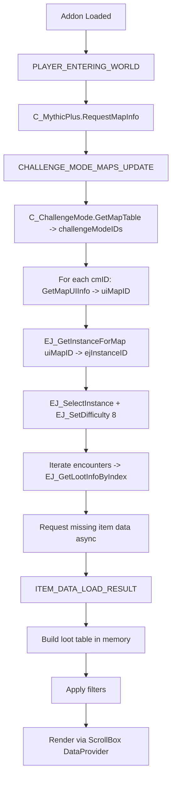
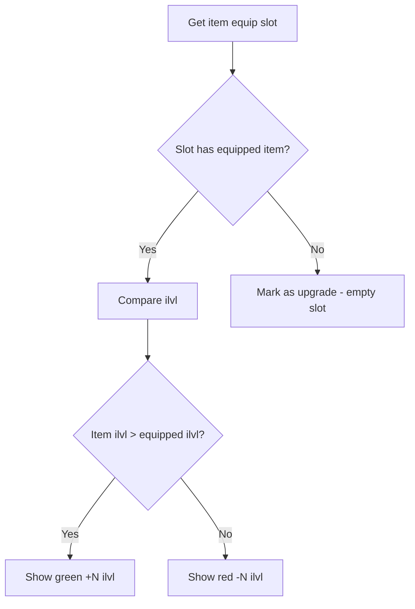

# EquipMap - WoW Mythic+ Equipment Browser

## Background

World of Warcraft players running Mythic+ dungeons need to know what loot is available across all dungeons in the current season. Currently, players must alt-tab to external websites (Wowhead, etc.) or manually browse the in-game Adventure Journal dungeon by dungeon. There is no consolidated, filterable view of all M+ loot in one place.

**Target**: WoW Retail 12.0 (Midnight), Midnight Season 1 M+ dungeons:
- Magister's Terrace, Maisara Caverns, Nexus Point Xenas, Windrunner Spire (Midnight dungeons)
- Algeth'ar Academy, Seat of the Triumvirate, Skyreach, Pit of Saron (legacy dungeons)

## Why

- Save players time by showing all M+ equipment in a single, filterable window
- Enable gear planning by comparing drops against currently equipped items
- Track which appearances are already collected (transmog)
- Highlight upgrade opportunities across all dungeons at a glance

## What

A standalone WoW addon called **EquipMap** that:
- Dynamically loads all M+ dungeon loot for the current season via in-game API
- Displays items in a scrollable, filterable grid/list
- Filters by: equipment slot, dungeon, armor type, class/spec relevance
- Compares items against equipped gear (ilvl delta)
- Highlights items the player already owns or has collected (transmog)
- Opens via `/equipmap` slash command

## How

### Architecture

```
EquipMap/
  EquipMap.toc          -- Addon manifest (Interface 120000)
  Core.lua              -- Addon init, event handling, slash command
  Data.lua              -- M+ dungeon/loot data loading via EJ API
  UI/
    MainFrame.lua       -- Main window: ScrollBox + DropdownButton (12.0 APIs)
  Compare.lua           -- Item comparison against equipped gear
  Filters.lua           -- Filter logic
  Utils.lua             -- Shared utilities, constants
  Tests/
    TestRunner.lua      -- Simple test harness for /equipmap test
    TestData.lua        -- Tests for data loading logic
    TestCompare.lua     -- Tests for comparison logic
    TestFilters.lua     -- Tests for filter logic
```

### Data Flow



### Key API Mapping (ChallengeMode -> Encounter Journal)

The critical bridge between M+ dungeons and EJ loot tables:

1. `C_ChallengeMode.GetMapTable()` -> `{challengeModeID, ...}`
2. `C_ChallengeMode.GetMapUIInfo(cmID)` -> `name, id, timeLimit, texture, bgTexture, uiMapID`
3. `EJ_GetInstanceForMap(uiMapID)` -> `ejInstanceID`
4. `EJ_SelectInstance(ejInstanceID)` -> selects the dungeon in EJ for loot queries

### In-memory data structure

```lua
EquipMap.db = {
    dungeons = {
        [ejInstanceID] = {
            name = "Dungeon Name",
            challengeModeID = cmID,
            uiMapID = uiMapID,
            instanceID = ejInstanceID,
            encounters = {
                [encounterID] = {
                    name = "Boss Name",
                    items = { ... }
                }
            }
        }
    },
    items = {  -- flat list for filtering
        { itemID, name, icon, ilvl, slot, slotID, armorType, itemLink,
          encounterID, encounterName, instanceID, dungeonName, owned, ilvlDelta }
    }
}
```

### UI Design (12.0 compatible)

Uses modern WoW 12.0 API:
- **DropdownButton** + `WowStyle1DropdownTemplate` for slot/dungeon filters (replaces deprecated UIDropDownMenu)
- **ScrollBox** + `WowScrollBoxList` + `MinimalScrollBar` + `CreateScrollBoxListLinearView()` for item list (replaces deprecated FauxScrollFrame)
- **BackdropTemplate** for window frame (still supported in 12.0)

### Filter System

Filters:
- **Slot**: Head, Neck, Shoulder, Back, Chest, Wrist, Hands, Waist, Legs, Feet, Ring, Trinket, Weapon
- **Dungeon**: Dropdown with all current season dungeons
- **Class/Spec**: Toggle to show only items usable by current class/spec (uses `EJ_SetLootFilter`)
- **Upgrades Only**: Toggle to show only items that are ilvl upgrades
- **Not Collected**: Toggle to show only items whose appearance is not yet collected

### Item Comparison Logic



Special cases:
- **Multi-slot** (rings, trinkets): compare against the lower ilvl of the two slots
- **Two-hand weapons**: compare against average of MH+OH

### Test Design

Tests run via `/equipmap test` slash command in-game:
- **TestData**: Verify slot mappings, BuildItemEntry, ParseDungeonList
- **TestCompare**: Verify ilvl delta, empty slot handling, multi-slot, 2H weapon comparison
- **TestFilters**: Verify slot/dungeon/upgrade/not-collected filters, combined filters

### Key Events

| Event | Handler |
|---|---|
| `PLAYER_ENTERING_WORLD` | Call `C_MythicPlus.RequestMapInfo()` |
| `CHALLENGE_MODE_MAPS_UPDATE` | Load dungeon data |
| `EJ_LOOT_DATA_RECIEVED` | Refresh loot |
| `ITEM_DATA_LOAD_RESULT` | Update async item details |
| `PLAYER_EQUIPMENT_CHANGED` | Re-evaluate comparisons |
| `TRANSMOG_COLLECTION_UPDATED` | Re-check owned status |
